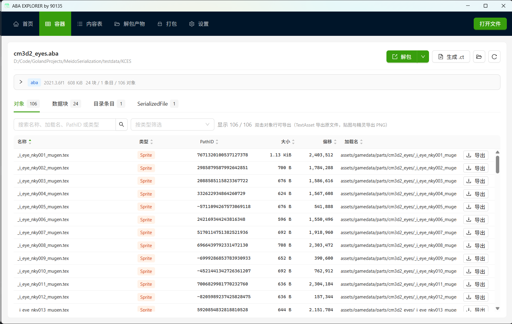
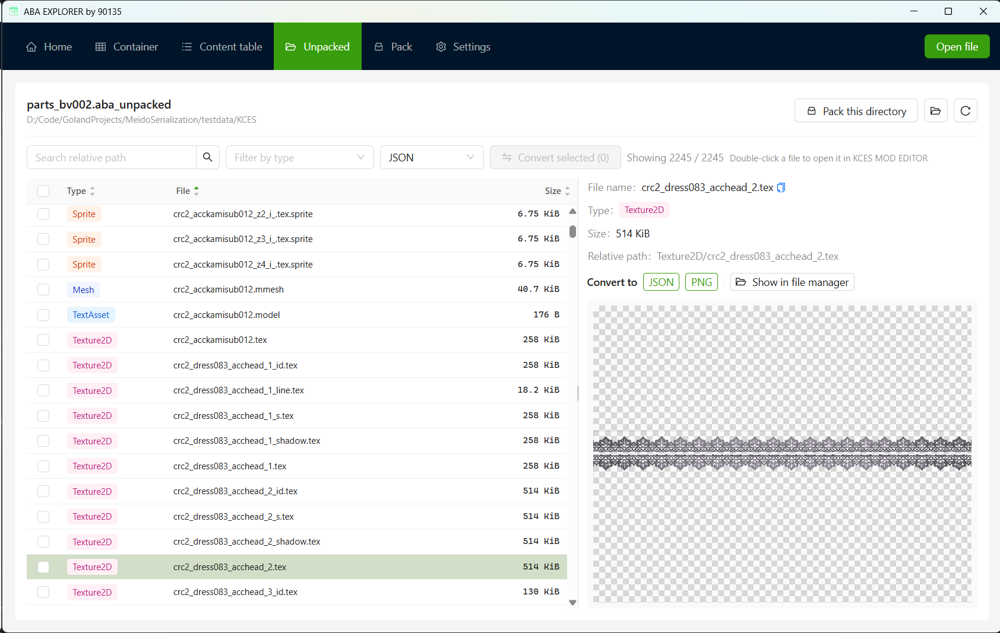
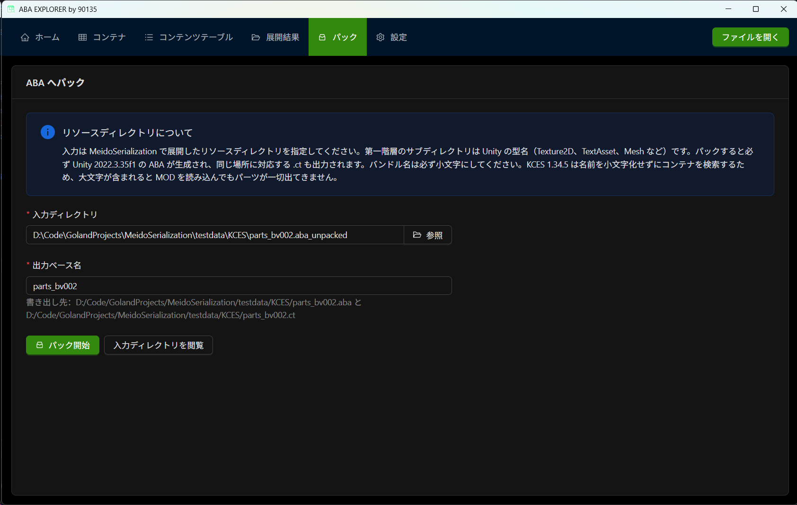
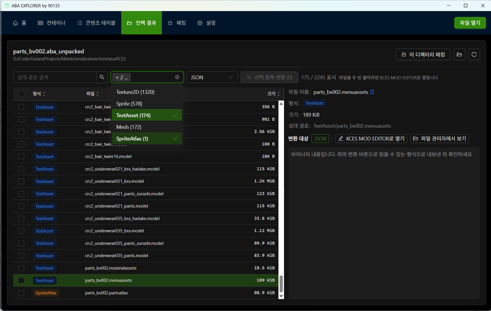

[English](#english) | [简体中文](#%E7%AE%80%E4%BD%93%E4%B8%AD%E6%96%87) | [日本語](#%E6%97%A5%E6%9C%AC%E8%AA%9E)

[Disclaimer/How to Dev/Credit/KISS Rule](#how-to-dev)

[]() [](https://deepwiki.com/MeidoPromotionAssociation/ABA_EXPLORER)

---

## 简体中文

[KCES](https://kces.jp/) 以及 KCES2 的 ABA 容器浏览器，用于查看 `.aba` 内部结构、解包与打包，并把提取出的资源转换为通用格式

是 [KCES MOD EDITOR](https://github.com/MeidoPromotionAssociation/KCES_MOD_EDITOR) 的兄弟项目：KCES MOD EDITOR 负责单个格式的编辑，本工具负责打包和解包容器本身。

基于 [MeidoSerialization](https://github.com/MeidoPromotionAssociation/MeidoSerialization) 序列化库，使用 Wails v3 + React 19 + Ant Design 6 + Golang 打造。

### 功能

- **容器浏览**：UnityFS 头部、块目录元数据、数据块、目录条目、每个 SerializedFile 的头部与外部引用
- **对象表**：容器内全部 Unity 对象的 PathID、类型、名称、大小、偏移与 AssetBundle 加载名，支持按类型与来源筛选
- **内容表浏览**：`.ct` 的 catalog（分类标志位、包类型、优先级、哈希）、扩展名表与虚拟文件，可单个或全部提取
- **解包**：提取为不含 metadata、预览图与外部流文件的纯资源目录，产物按 Unity 类型分目录
- **打包**：把纯资源目录打回固定 Unity 2022.3.35f1 的 ABA，同时生成配套 `.ct`，并展示打包器给出的游戏加载警告
- **预览**：Texture2D 与 Sprite 直接解码成图片，文本资源按 UTF-8 展示
- **转换**：Texture2D/Sprite → PNG，Mesh/AnimationClip/Model → glTF/GLB，AudioClip → 原始音频，`.nei` → CSV，以及各 KCES 结构化格式 → JSON，支持批量并逐条报告结果
- **交给编辑器**：解包产物里 `.menuassets` 这类有编辑页面的格式，可以按钮或双击通过 `kces-mod-editor://` 协议交给 [KCES_MOD_EDITOR](https://github.com/MeidoPromotionAssociation/KCES_MOD_EDITOR) 打开，请先安装该软件
- 文件拖放、文件关联打开、`Ctrl+O` 快捷键、深色模式跟随系统
- 拥有完整的多国语言支持，如果您想添加语言，请通过 Issues 或 Pull Request 为我们贡献。

### 支持的文件

| 描述                        | 格式                                                                                                     |
|-----------------------------|----------------------------------------------------------------------------------------------------------|
| 解包和打包Unity Bundle 容器 | `.aba` `.asset_bg` `.asset_scene`                                                                        |
| 查看和生成内容表            | `.ct`                                                                                                    |
| 解包产物格式互转            | 解包产物与 KCES 原生格式（`.menuassets` `.model` `.texture2d` `.mmesh` `.anm` `.audioclip` `.bytes` 等） |

`.menuassets` 这类单个格式的结构化编辑请使用 [KCES_MOD_EDITOR](https://github.com/MeidoPromotionAssociation/KCES_MOD_EDITOR)。

### 依赖

该应用需要以下软件以运行：

- Microsoft Edge WebView2
  - 本应用使用 Wails 技术打造，它依赖于 Microsoft Edge WebView2 来渲染页面，因此需要安装 WebView2。
  - 如果你使用 Windows 11，这通常已经安装在你的系统上了。
  - 如果你使用其他系统，且没有安装 WebView2，启动应用程序时它应该会提示您安装。
    或者您也可以从官方网站安装：[https://developer.microsoft.com/zh-cn/microsoft-edge/webview2](https://developer.microsoft.com/zh-cn/microsoft-edge/webview2)
  - Microsoft Edge WebView2
    是什么？[https://learn.microsoft.com/zh-cn/microsoft-edge/webview2/](https://learn.microsoft.com/zh-cn/microsoft-edge/webview2/)
- ImageMagick
  - 使用 .tex 格式和图片处理相关功能需要安装 ImageMagick，这是为了支持尽可能多的图片格式。如果您不使用 .tex 编辑，您可以选择不安装。
  - 请从官方网站安装：[https://imagemagick.org/download](https://imagemagick.org/download)
  - 在下载页面上找到 `ImageMagick-版本号-Q16-HDRI-x64-dll.exe` 下载并安装，安装时需要勾选
    `Add application directory to your system path`
  - 或者在您的终端执行 `winget install ImageMagick.Q16-HDRI` 命令安装。
  - 用于测试的版本是 `ImageMagick-7.1.2-30-Q16-HDRI-x64-dll.exe` 如果出现问题，请尝试这个版本。
  - 安装完成后在终端执行 `magick -version` 命令查看版本号，如果显示版本号则说明安装成功。
  - ImageMagick® 是一个自由的开源软件套件，用于编辑和操纵数字图像。

### 隐私

本应用不会收集任何个人信息，也不会上传任何信息到任何服务器。

唯一的主动网络请求是用于检查更新，它只会请求 GitHub API，您也可以关闭更新检查功能。

### 下载

下载此软件即表示您接受并同意遵守[免责声明](https://github.com/MeidoPromotionAssociation/ABA_EXPLORER?tab=readme-ov-file#disclaimer)

请在 Github Releases
中下载：[https://github.com/MeidoPromotionAssociation/ABA_EXPLORER/releases](https://github.com/MeidoPromotionAssociation/ABA_EXPLORER/releases)

- 如果您希望将编辑器安装到系统中并自动关联文件类型，请使用 `aba-explorer-amd64-installer.exe`
    - 关联文件类型后，不同的文件将显示不同的图标。请查看[此处](https://github.com/MeidoPromotionAssociation/ABA_EXPLORER/tree/main/build)预览图标
- 如果您不想安装，请使用 `aba-explorer.exe`
- 如果您使用的是 Linux 系统，请使用 `aba-explorer_linux_amd64`

### 也可以看看其他仓库

- [COM3D2 MOD 编辑器](https://github.com/MeidoPromotionAssociation/COM3D2_MOD_EDITOR)
- [KCES MOD 编辑器](https://github.com/MeidoPromotionAssociation/KCES_MOD_EDITOR)
- [ABA 浏览器](https://github.com/MeidoPromotionAssociation/ABA_EXPLORER)
- [MeidoSerialization](https://github.com/MeidoPromotionAssociation/MeidoSerialization)
- [COM3D2 简明中文 MOD 教程](https://github.com/MeidoPromotionAssociation/COM3D2_Simple_MOD_Guide_Chinese)
- [另一个 COM3D2 翻译插件 JAT](https://github.com/MeidoPromotionAssociation/COM3D2.JustAnotherTranslator.Plugin)
- [90135 的 COM3D2 中文指北](https://github.com/90135/COM3D2_GUIDE_CHINESE)
- [90135 的 COM3D2 脚本收藏集](https://github.com/90135/COM3D2_Scripts_901)
- [90135 的 COM3D2 工具](https://github.com/90135/COM3D2_Tools_901)

<br>

| 截图                        | 截图                        | 截图                        | 截图                        |
|---------------------------|---------------------------|---------------------------|---------------------------|
|  |  |  |  |

<br>
<br>
<br>

---

<br>
<br>
<br>

## English

An ABA container browser for [KCES](https://kces.jp/) and KCES2, used to inspect the internal structure of `.aba` files, unpack and pack them, and convert the extracted assets into common formats.

It is a sibling project of [KCES MOD EDITOR](https://github.com/MeidoPromotionAssociation/KCES_MOD_EDITOR): KCES MOD EDITOR handles editing of individual formats, while this tool handles packing and unpacking the containers themselves.

Based on the [MeidoSerialization](https://github.com/MeidoPromotionAssociation/MeidoSerialization) serialization library, built with Wails v3 + React 19 + Ant Design 6 + Golang.

### Features

- **Container browsing**: UnityFS header, block directory metadata, data blocks, directory entries, and the header and external references of every SerializedFile
- **Object table**: PathID, type, name, size, offset and AssetBundle load name of every Unity object in the container, filterable by type and source
- **Content table browsing**: the catalog of `.ct` files (category flags, package type, priority, hash), the extension table and virtual files, extractable individually or all at once
- **Unpacking**: extract into a pure asset directory without metadata, preview images or external stream files, with output organized into directories by Unity type
- **Packing**: pack a pure asset directory back into an ABA fixed at Unity 2022.3.35f1, generate the matching `.ct` at the same time, and show the in-game loading warnings reported by the packer
- **Preview**: Texture2D and Sprite are decoded directly into images, text assets are shown as UTF-8
- **Conversion**: Texture2D/Sprite → PNG, Mesh/AnimationClip/Model → glTF/GLB, AudioClip → raw audio, `.nei` → CSV, and each structured KCES format → JSON, with batch support and per-item result reporting
- **Hand off to the editor**: unpacked formats that have an editing page, such as `.menuassets`, can be opened in [KCES_MOD_EDITOR](https://github.com/MeidoPromotionAssociation/KCES_MOD_EDITOR) through the `kces-mod-editor://` protocol via a button or a double click. Please install that software first
- Drag and drop, opening through file associations, the `Ctrl+O` shortcut, and dark mode following the system
- Full multi-language support. If you would like to add a language, please contribute through Issues or Pull Requests.

### Supported files

| Description                                   | Formats                                                                                                                   |
|-----------------------------------------------|---------------------------------------------------------------------------------------------------------------------------|
| Unpacking and packing Unity Bundle containers | `.aba` `.asset_bg` `.asset_scene`                                                                                         |
| Viewing and generating content tables         | `.ct`                                                                                                                     |
| Conversion between unpacked asset formats     | Unpacked output and KCES native formats (`.menuassets` `.model` `.texture2d` `.mmesh` `.anm` `.audioclip` `.bytes`, etc.)  |

For structured editing of individual formats such as `.menuassets`, please use [KCES_MOD_EDITOR](https://github.com/MeidoPromotionAssociation/KCES_MOD_EDITOR).

### Dependencies

This application requires the following software to run:

- Microsoft Edge WebView2
  - This application is built with Wails, which relies on Microsoft Edge WebView2 to render pages, so WebView2 needs to be installed.
  - If you use Windows 11, it is usually already installed on your system.
  - If you use another system and do not have WebView2 installed, the application should prompt you to install it on startup.
    Alternatively, you can install it from the official website: [https://developer.microsoft.com/en-us/microsoft-edge/webview2](https://developer.microsoft.com/en-us/microsoft-edge/webview2)
  - What is Microsoft Edge
    WebView2? [https://learn.microsoft.com/en-us/microsoft-edge/webview2/](https://learn.microsoft.com/en-us/microsoft-edge/webview2/)
- ImageMagick
  - Using the .tex format and image processing related features requires ImageMagick, in order to support as many image formats as possible. If you do not use .tex editing, you may choose not to install it.
  - Please install it from the official website: [https://imagemagick.org/download](https://imagemagick.org/download)
  - Find `ImageMagick-<version>-Q16-HDRI-x64-dll.exe` on the download page, download and install it, and make sure to check
    `Add application directory to your system path` during installation.
  - Alternatively, run `winget install ImageMagick.Q16-HDRI` in your terminal to install it.
  - The version used for testing is `ImageMagick-7.1.2-30-Q16-HDRI-x64-dll.exe`. If you run into problems, please try this version.
  - After installation, run `magick -version` in a terminal to check the version number. If a version number is shown, the installation succeeded.
  - ImageMagick® is a free and open-source software suite for editing and manipulating digital images.

### Privacy

This application does not collect any personal information, and does not upload any information to any server.

The only outgoing network request is for checking updates, and it only calls the GitHub API. You can also turn the update check feature off.

### Download

By downloading this software, you accept and agree to abide by the [Disclaimer](https://github.com/MeidoPromotionAssociation/ABA_EXPLORER?tab=readme-ov-file#disclaimer)

Please download from Github
Releases: [https://github.com/MeidoPromotionAssociation/ABA_EXPLORER/releases](https://github.com/MeidoPromotionAssociation/ABA_EXPLORER/releases)

- If you want to install the editor into your system and automatically associate file types, use `aba-explorer-amd64-installer.exe`
    - After file types are associated, different files will show different icons. See [here](https://github.com/MeidoPromotionAssociation/ABA_EXPLORER/tree/main/build) to preview the icons
- If you do not want to install it, use `aba-explorer.exe`
- If you are on Linux, use `aba-explorer_linux_amd64`

### See also our other repositories

- [COM3D2 MOD EDITOR](https://github.com/MeidoPromotionAssociation/COM3D2_MOD_EDITOR)
- [KCES MOD EDITOR](https://github.com/MeidoPromotionAssociation/KCES_MOD_EDITOR)
- [ABA EXPLORER](https://github.com/MeidoPromotionAssociation/ABA_EXPLORER)
- [MeidoSerialization](https://github.com/MeidoPromotionAssociation/MeidoSerialization)
- [COM3D2 Simple MOD Guide (Chinese)](https://github.com/MeidoPromotionAssociation/COM3D2_Simple_MOD_Guide_Chinese)
- [Just Another Translator for COM3D2 (JAT)](https://github.com/MeidoPromotionAssociation/COM3D2.JustAnotherTranslator.Plugin)
- [90135's COM3D2 Guide (Chinese)](https://github.com/90135/COM3D2_GUIDE_CHINESE)
- [90135's COM3D2 Scripts Collection](https://github.com/90135/COM3D2_Scripts_901)
- [90135's COM3D2 Tools](https://github.com/90135/COM3D2_Tools_901)

<br>

| Screenshot                | Screenshot                | Screenshot                | Screenshot                |
|---------------------------|---------------------------|---------------------------|---------------------------|
|  |  |  |  |


<br>
<br>
<br>

---

<br>
<br>
<br>

## 日本語

[KCES](https://kces.jp/) および KCES2 の ABA コンテナブラウザーです。`.aba` の内部構造の閲覧、アンパックとパック、そして抽出したリソースの汎用フォーマットへの変換を行えます

[KCES MOD EDITOR](https://github.com/MeidoPromotionAssociation/KCES_MOD_EDITOR) の姉妹プロジェクトです：KCES MOD EDITOR が個別フォーマットの編集を担当し、本ツールはコンテナ自体のパックとアンパックを担当します。

[MeidoSerialization](https://github.com/MeidoPromotionAssociation/MeidoSerialization) シリアライズライブラリをベースに、Wails v3 + React 19 + Ant Design 6 + Golang で開発されています。

### 機能

- **コンテナ閲覧**：UnityFS ヘッダー、ブロックディレクトリのメタデータ、データブロック、ディレクトリエントリ、各 SerializedFile のヘッダーと外部参照
- **オブジェクト一覧**：コンテナ内のすべての Unity オブジェクトの PathID、型、名前、サイズ、オフセット、AssetBundle 読み込み名を表示し、型と出所によるフィルタリングに対応
- **コンテンツテーブル閲覧**：`.ct` の catalog（カテゴリフラグ、パッケージ種別、優先度、ハッシュ）、拡張子テーブル、仮想ファイルを閲覧でき、個別または一括で抽出可能
- **アンパック**：metadata、プレビュー画像、外部ストリームファイルを含まない純粋なリソースディレクトリとして抽出し、出力は Unity の型ごとにディレクトリ分けされます
- **パック**：純粋なリソースディレクトリを Unity 2022.3.35f1 固定の ABA に戻し、対応する `.ct` も同時に生成し、パッカーが報告するゲーム読み込み時の警告を表示します
- **プレビュー**：Texture2D と Sprite は直接画像にデコードし、テキストリソースは UTF-8 として表示します
- **変換**：Texture2D/Sprite → PNG、Mesh/AnimationClip/Model → glTF/GLB、AudioClip → 生の音声、`.nei` → CSV、および各 KCES 構造化フォーマット → JSON。一括処理に対応し、結果を項目ごとに報告します
- **エディターへ引き渡す**：アンパック結果のうち `.menuassets` のように編集ページを持つフォーマットは、ボタンまたはダブルクリックで `kces-mod-editor://` プロトコル経由で [KCES_MOD_EDITOR](https://github.com/MeidoPromotionAssociation/KCES_MOD_EDITOR) で開けます。事前に当該ソフトウェアをインストールしてください
- ファイルのドラッグ＆ドロップ、ファイル関連付けからの起動、`Ctrl+O` ショートカット、システムに追従するダークモード
- 完全な多言語対応を備えています。言語を追加したい場合は、Issues または Pull Request でぜひご協力ください。

### 対応ファイル

| 説明                                    | フォーマット                                                                                                                   |
|---------------------------------------|--------------------------------------------------------------------------------------------------------------------------|
| Unity Bundle コンテナのアンパックとパック          | `.aba` `.asset_bg` `.asset_scene`                                                                                        |
| コンテンツテーブルの閲覧と生成                       | `.ct`                                                                                                                    |
| アンパック結果フォーマットの相互変換                    | アンパック結果と KCES ネイティブフォーマット（`.menuassets` `.model` `.texture2d` `.mmesh` `.anm` `.audioclip` `.bytes` など）                    |

`.menuassets` のような個別フォーマットの構造化編集には [KCES_MOD_EDITOR](https://github.com/MeidoPromotionAssociation/KCES_MOD_EDITOR) をご利用ください。

### 依存関係

本アプリケーションの実行には以下のソフトウェアが必要です：

- Microsoft Edge WebView2
  - 本アプリケーションは Wails 技術で開発されており、ページのレンダリングに Microsoft Edge WebView2 を利用するため、WebView2 のインストールが必要です。
  - Windows 11 をお使いの場合、通常は既にシステムにインストールされています。
  - それ以外のシステムをお使いで WebView2 がインストールされていない場合、アプリケーション起動時にインストールを促されるはずです。
    または公式サイトからインストールすることもできます：[https://developer.microsoft.com/ja-jp/microsoft-edge/webview2](https://developer.microsoft.com/ja-jp/microsoft-edge/webview2)
  - Microsoft Edge WebView2
    とは？[https://learn.microsoft.com/ja-jp/microsoft-edge/webview2/](https://learn.microsoft.com/ja-jp/microsoft-edge/webview2/)
- ImageMagick
  - .tex フォーマットや画像処理関連の機能を使用するには ImageMagick のインストールが必要です。これは可能な限り多くの画像フォーマットに対応するためです。.tex の編集を行わない場合は、インストールしないという選択も可能です。
  - 公式サイトからインストールしてください：[https://imagemagick.org/download](https://imagemagick.org/download)
  - ダウンロードページで `ImageMagick-バージョン番号-Q16-HDRI-x64-dll.exe` を見つけてダウンロードし、インストール時に
    `Add application directory to your system path` にチェックを入れてください。
  - またはターミナルで `winget install ImageMagick.Q16-HDRI` コマンドを実行してインストールしてください。
  - テストに使用したバージョンは `ImageMagick-7.1.2-30-Q16-HDRI-x64-dll.exe` です。問題が発生した場合はこのバージョンをお試しください。
  - インストール完了後、ターミナルで `magick -version` コマンドを実行してバージョン番号を確認してください。バージョン番号が表示されればインストール成功です。
  - ImageMagick® は、デジタル画像の編集と加工のための自由なオープンソースソフトウェアスイートです。

### プライバシー

本アプリケーションは個人情報を一切収集せず、いかなる情報もいかなるサーバーにもアップロードしません。

唯一の能動的なネットワークリクエストは更新確認のためのもので、GitHub API にのみリクエストします。更新確認機能をオフにすることもできます。

### ダウンロード

本ソフトウェアをダウンロードすることは、[免責事項](https://github.com/MeidoPromotionAssociation/ABA_EXPLORER?tab=readme-ov-file#disclaimer)を受諾し、遵守することに同意したものとみなされます

Github Releases
からダウンロードしてください：[https://github.com/MeidoPromotionAssociation/ABA_EXPLORER/releases](https://github.com/MeidoPromotionAssociation/ABA_EXPLORER/releases)

- エディターをシステムにインストールし、ファイルの種類を自動的に関連付けたい場合は `aba-explorer-amd64-installer.exe` をご利用ください
    - ファイルの種類を関連付けると、ファイルごとに異なるアイコンが表示されます。アイコンのプレビューは[こちら](https://github.com/MeidoPromotionAssociation/ABA_EXPLORER/tree/main/build)をご覧ください
- インストールしたくない場合は `aba-explorer.exe` をご利用ください
- Linux システムをお使いの場合は `aba-explorer_linux_amd64` をご利用ください

### 他のリポジトリもご覧ください

- [COM3D2 MOD エディター](https://github.com/MeidoPromotionAssociation/COM3D2_MOD_EDITOR)
- [KCES MOD エディター](https://github.com/MeidoPromotionAssociation/KCES_MOD_EDITOR)
- [ABA ブラウザー](https://github.com/MeidoPromotionAssociation/ABA_EXPLORER)
- [MeidoSerialization](https://github.com/MeidoPromotionAssociation/MeidoSerialization)
- [COM3D2 簡明中文 MOD ガイド](https://github.com/MeidoPromotionAssociation/COM3D2_Simple_MOD_Guide_Chinese)
- [もう一つの COM3D2 翻訳プラグイン JAT](https://github.com/MeidoPromotionAssociation/COM3D2.JustAnotherTranslator.Plugin)
- [90135 の COM3D2 中文ガイド](https://github.com/90135/COM3D2_GUIDE_CHINESE)
- [90135 の COM3D2 スクリプト集](https://github.com/90135/COM3D2_Scripts_901)
- [90135 の COM3D2 ツール](https://github.com/90135/COM3D2_Tools_901)

<br>

| スクリーンショット                 | スクリーンショット                 | スクリーンショット                 | スクリーンショット                 |
|---------------------------|---------------------------|---------------------------|---------------------------|
|  |  |  |  |

<br>
<br>
<br>
<br>
<br>
<br>

---

<br>
<br>
<br>
<br>
<br>
<br>

# How to Dev

1. Clone this repo, and cd to project root
2. Install [Golang](https://go.dev/)  latest version
3. Run `go install github.com/wailsapp/wails/v3/cmd/wails3@latest`
4. Install [Nodejs](https://nodejs.org/) v24 lts
5. Install pnpm [https://pnpm.io/installation#installing-pnpm-12](https://pnpm.io/installation#installing-pnpm-12)
6. Run `cd .\frontend\` and `pnpm install`

<br>

- Run `wails3 dev` in project root to run in dev mode
- Run `wails3 build` in project root to build project
- Run `wails3 package` to get installer
- This is a Wails v3 App. The front-end method is automatically generated after the back-end is bound.

<br>

# KISS Rule

[KISS](https://www.kisskiss.tv/) is the company/brand that makes these games.

*This Project is not owned or endorsed by KISS.

*MODs are not supported by KISS.

*KISS cannot be held responsible for any problems that may arise when using MODs.

*If any problem occurs, please do not contact KISS.

```
KISS 規約

・原作がMOD作成者にある場合、又は、原作が「カスタムメイド3D2」のみに存在する内部データの場合、又は、原作が「カスタムメイド3D2」と「カスタムオーダーメイド3D2」の両方に存在する内部データの場合。
※MODはKISSサポート対象外です。
※MODを利用するに当たり、問題が発生してもKISSは一切の責任を負いかねます。
※「カスタムメイド3D2」か「カスタムオーダーメイド3D2」か「CR EditSystem」を購入されている方のみが利用できます。
※「カスタムメイド3D2」か「カスタムオーダーメイド3D2」か「CR EditSystem」上で表示する目的以外の利用は禁止します。
※これらの事項は https://kisskiss.tv/kiss/diary.php?no=558 を優先します。

・原作が「カスタムオーダーメイド3D2(GP01含む)」の内部データのみにある場合。
※MODはKISSサポート対象外です。
※MODを利用するに当たり、問題が発生してもKISSは一切の責任を負いかねます。
※「カスタムオーダーメイド3D2」か「CR EditSystem」をを購入されている方のみが利用できます。
※「カスタムオーダーメイド3D2」か「CR EditSystem」上で表示する目的以外の利用は禁止します。
※「カスタムメイド3D2」上では利用しないで下さい。
※これらの事項は https://kisskiss.tv/kiss/diary.php?no=558 を優先します。

・原作が「CR EditSystem」の内部データのみにある場合。
※MODはKISSサポート対象外です。
※MODを利用するに当たり、問題が発生してもKISSは一切の責任を負いかねます。
※「CR EditSystem」を購入されている方のみが利用できます。
※「CR EditSystem」上で表示する目的以外の利用は禁止します。
※「カスタムメイド3D2」「カスタムオーダーメイド3D2」上では利用しないで下さい。
※これらの事項は https://kisskiss.tv/kiss/diary.php?no=558 を優先します。
```

<br>

# Disclaimer

By downloading this software, you agree to read, accept and abide by this Disclaimer, this is a developer protection
measure and we apologize for any inconvenience this may cause.

下载此软件即表示您已阅读且接受并同意遵守此免责声明，这是为了保护开发人员而采取的措施，对于由此造成的不便，我们深表歉意。

本ソフトウェアをダウンロードすることにより、利用者は本免責事項を読み、内容を理解し、全ての条項に同意し、遵守することを表明したものとみなされます。これは開発者保護のための措置であることをご理解いただき、ご不便をおかけする場合もあらかじめご了承ください。

```
English

In case of any discrepancy between the translated versions, the Simplified Chinese version shall prevail.

1. Tool Nature Statement
    This project is an open-source tool released under the BSD-3-Clause license. The developer(s) (hereinafter referred to as "the Author") are individual technical researchers only. The Author does not derive any commercial benefit from this tool and does not provide any form of online service or user account system.
    This tool is a purely local data processing tool with no content generation capabilities whatsoever. It possesses no online upload or download functionality.
    At its core, this tool is a format converter. All output content is the result of format conversion applied to the user's original input data. The tool itself does not generate, modify, or inject any new data content.

2. Usage restrictions
  This software shall not be used for any illegal purposes. This includes, but is not limited to, creating or disseminating obscene or illegal materials, infringing upon the intellectual property rights of others, violating platform user agreements, or any other actions that may contravene the laws and regulations of the user's jurisdiction.
    Users shall bear full responsibility for any consequences arising from violations of the law.
  
  Users must commit to:
      - Not creating, publishing, transmitting, disseminating, or storing any content that violates the laws and regulations of their jurisdiction.
      - Not creating, publishing, transmitting, disseminating, or storing obscene or illegal materials.
      - Not creating, publishing, transmitting, disseminating, or storing content that infringes upon the intellectual property rights of others.
      - Not creating, publishing, transmitting, disseminating, or storing content that violates platform user agreements.
      - Not using the tool for any activities that endanger national security or undermine social stability.
      - Not using the tool to conduct cyber attacks or crack licensed software.
      - The Author has no legal association with user-generated content.
      - Any content created using this tool that violates local laws and regulations (including but not limited to pornography, violence, or infringing content) entails legal liability borne solely by the content creator.

3. Liability exemption
  Given the nature of open-source projects:
      - The Author cannot monitor the use of all derivative code.
      - The Author is not responsible for modified versions compiled/distributed by users.
      - The Author assumes no liability for any legal consequences resulting from illegal use by users.
      - The Author provides no technical guarantee for content review or filtering.
      - The tool's operational mechanism inherently prevents it from recognizing or filtering content nature.
      - All data processing occurs solely on the user's local device; the Author cannot access or control any user data.

  Users acknowledge and agree that:
      - This tool possesses no content generation capabilities; the final content depends entirely on the input files. The tool merely performs format conversion operations and cannot be held responsible for the legality, nature, or usage context of the user's input data.
      - This tool contains no data upload/download capabilities; all content processing is completed on the user's local device.
      - If illegal activities involving this tool are discovered, they must be reported immediately to the public security authorities.
      - The Author reserves the right to cease distribution of specific versions suspected of being abused.

4. Age and guardianship responsibility
  Users must be persons with full civil capacity (18 years of age or older). Minors are prohibited from downloading, installing or using this tool. Guardians must assume full management responsibility for device access.

5. Agreement Update
  The author has the right to update this statement through the GitHub repository. Continued use is deemed to accept the latest version of the terms.

6. Disclaimer of Warranty
  This tool is provided "AS IS" and the developer expressly disclaims any express or implied warranties, including but not limited to:
    - Warranty of merchantability
    - Warranty of fitness for a particular purpose
    - Warranty of code freedom from defects or potential risks
    - Warranty of continuous availability and technical support

7. Waiver of liability for damages
  Regardless of the use/inability to use this tool resulting in:
    - Direct/indirect property loss
    - Data loss or business interruption
    - Third-party claims or administrative penalties
  The developer shall not bear any civil, administrative or criminal liability

8. Waiver of liability for third-party reliance
  If the third-party libraries/components included or relied upon by this tool have:
    - Intellectual property disputes
    - Security vulnerabilities
    - Content that violates local laws
    - Subject to criminal or civil penalties
  The developer shall not bear joint and several liability, and users should review the relevant licenses on their own

9. Version iteration risk
  Users understand and accept:
    - Different versions of code may have compatibility issues
    - Developers are not obliged to maintain the security of old versions
    - Modifying the code on your own may lead to unforeseen legal risks

简体中文

1. 工具性质声明  
   本项目是基于 BSD-3-Clause 许可证的开源工具。开发者（以下简称"作者"）仅为个人技术研究者，不通过本工具获取任何商业利益，亦不提供任何形式的在线服务及用户账号体系。
   本工具为纯本地化数据处理工具，不具备任何内容生成能力，无任何在线上传下载功能。
   本工具本质上是一个格式转换器，所有输出内容均为用户提供的原始数据的格式转换结果，工具本身不产生、修改或注入任何新数据内容。

2. 使用限制
   本软件不得用于任何违法用途，包括但不限于制作、传播淫秽违法物品、侵害他人知识产权、违反平台用户协议的行为等可能违反所在地法律法规的违法行为。
   使用者因违反法律造成的后果需自行承担全部责任。

   用户必须承诺：  
     - 不制作、发布、传送、传播、储存任何违反所在地法律法规的内容
     - 不制作、发布、传送、传播、储存淫秽违法物品
     - 不制作、发布、传送、传播、储存侵害他人知识产权的内容
     - 不制作、发布、传送、传播、储存违反平台用户协议的内容
     - 不将工具用于任何危害国家安全或破坏社会稳定的活动
     - 不使用本工具实施网络攻击或破解正版软件
     - 开发者与用户生成内容无法律关联性
     - 任何使用本工具创建违反当地法律法规的内容（包括但不限于色情、暴力、侵权内容），其法律责任由内容创建者独立承担

3. 责任豁免  
   鉴于开源项目特性：  
     - 作者无法监控所有衍生代码的使用
     - 不负责用户自行编译/分发的修改版本
     - 不承担用户非法使用导致的任何法律责任
     - 不提供内容审核或过滤的技术保证
     - 工具运行机制决定其无法识别或过滤内容性质
     - 所有数据处理均在用户本地设备完成，开发者无法访问或控制任何用户数据

   用户知悉并同意：
     - 本工具不具备任何内容生成能力，最终内容完全取决于其输入文件。工具仅执行格式转换操作，无法对用户输入数据的合法性、内容性质及使用场景负责。
     - 本工具不包含任何数据上传/下载功能，所有内容生成均在用户本地设备完成
     - 如发现有人利用本工具从事违法活动，应立即向公安机关举报
     - 开发者保留停止分发涉嫌被滥用的特定版本的权利

4. 年龄及监护责任  
   用户须为完全民事行为能力人（18 周岁及以上），禁止未成年人下载、安装或使用。监护人须对设备访问承担完全管理责任。

5. 协议更新  
   作者有权通过 GitHub 仓库更新本声明，继续使用视为接受最新版本条款。

6. 担保免责  
  此工具按"原样"提供，不附带任何明示或暗示的保证，包括但不限于：
     - 适销性担保  
     - 特定用途适用性担保  
     - 代码无缺陷或潜在风险担保  
     - 持续可用性及技术支持担保  

7. 损害赔偿责任免除  
   无论使用/无法使用本工具导致：  
     - 直接/间接财产损失
     - 数据丢失或业务中断
     - 第三方索赔或行政处罚
     - 受到刑事或民事处罚
   开发者均不承担民事、行政或刑事责任  

8. 第三方依赖免责  
   本工具包含或依赖的第三方库/组件如存在：  
     - 知识产权纠纷  
     - 安全漏洞  
     - 违反当地法律的内容  
   开发者不承担连带责任，用户应自行审查相关许可  

9. 版本迭代风险  
    用户理解并接受：  
     - 不同版本代码可能存在兼容性问题  
     - 开发者无义务维护旧版本安全性  
     - 自行修改代码可能导致不可预见的法律风险


日本語

本声明の翻訳版（日本語を含む）と簡体中文原文に解釈上の相違がある場合は、簡体中文版が優先的に有効とします。

1. ツールの性質に関する声明
   本プロジェクトは、BSD-3-Clause ライセンスに基づくオープンソースツールです。開発者（以下「作者」）は個人の技術研究者に過ぎず、本ツールを通じていかなる商業的利益も得ておらず、いかなる形式のオンラインサービス及びユーザーアカウントシステムも提供しません。
   本ツールは純粋にローカル環境でのデータ処理ツールであり、いかなるコンテンツ生成能力も有しておらず、いかなるオンラインアップロード・ダウンロード機能も備えていません。
   本ツールは本質的にフォーマット変換ツールであり、すべての出力内容はユーザーが提供したオリジナルデータのフォーマット変換結果です。ツール自体は、いかなる新しいデータ内容も生成、修正、または注入しません。

2. 使用制限
   本ソフトウェアは、以下のような、所在地の法令に違反する可能性のある違法行為を含むがこれに限定されない、いかなる違法目的にも使用してはなりません：
     - わいせつ物や違法物の作成・頒布
     - 他人の知的財産権の侵害
     - プラットフォーム利用規約違反行為
   使用者は、法律違反によって生じた結果について、自ら全ての責任を負うものとします。

   ユーザーは以下を確約しなければなりません：
     - 所在地の法令に違反する内容を、作成、公開、送信、拡散、保存しないこと。
     - わいせつ物や違法物を、作成、公開、送信、拡散、保存しないこと。
     - 他人の知的財産権を侵害する内容を、作成、公開、送信、拡散、保存しないこと。
     - プラットフォーム利用規約に違反する内容を、作成、公開、送信、拡散、保存しないこと。
     - 本ツールを国家安全を脅かす、または社会の安定を破壊する活動に使用しないこと。
     - 本ツールを使用してネットワーク攻撃を実行したり、正規ソフトウェアのクラッキングを行わないこと。
     - 開発者はユーザー生成コンテンツとの法的関連性を一切有しないこと。
     - 本ツールを使用して作成された、当地の法令に違反するコンテンツ（ポルノ、暴力、著作権侵害等を含むがこれに限定されない）についての法的責任は、コンテンツ作成者が単独で負うこと。

3. 免責事項
   オープンソースプロジェクトの性質上：
     - 作者はすべての派生コードの使用状況を監視することはできません。
     - ユーザー自身がコンパイル/配布する修正版について責任を負いません。
     - ユーザーの違法使用に起因するいかなる法的責任も負いません。
     - コンテンツ審査やフィルタリングの技術的保証は提供しません。
     - ツールの動作メカニズム上、コンテンツの性質を識別またはフィルタリングすることはできません。
     - すべてのデータ処理はユーザーのローカルデバイス上で完了し、開発者はユーザーデータにアクセスまたは制御することはできません。

   ユーザーはこれを理解し同意するものとします：
     - 本ツールはコンテンツ生成能力を一切有しておらず、最終的なコンテンツは完全に入力ファイルに依存します。ツールはフォーマット変換操作のみを実行し、ユーザー入力データの合法性、内容の性質、および使用シナリオについて責任を負うことはできません。
     - 本ツールにはいかなるデータアップロード/ダウンロード機能も含まれておらず、すべてのコンテンツ生成はユーザーのローカルデバイス上で完了します。
     - 本ツールを利用した違法行為を発見した場合は、直ちに公安機関に通報すること。
     - 開発者は、悪用の疑いのある特定バージョンの配布停止権利を留保します。

4. 年齢及び監督責任
   ユーザーは完全民事行為能力者（18歳以上）でなければなりません。未成年者のダウンロード、インストール、または使用は禁止されています。保護者はデバイスへのアクセスについて完全な管理責任を負うものとします。

5. 規約の更新
   作者は、GitHub リポジトリを通じて本声明を更新する権利を有します。継続的な使用は最新版の条項の受諾とみなされます。

6. 保証の免責
   本ツールは「現状のまま」提供され、商品性、特定目的への適合性、コードの欠陥や潜在リスクの不存在、継続的な利用可能性及び技術サポートの保証を含むがこれらに限定されない、明示または黙示を問わず、いかなる保証も付帯しません。

7. 損害賠償責任の免責
   本ツールの使用または使用不能によって生じた以下の事項について、開発者は民事、行政、または刑事上のいかなる責任も負いません：
     - 直接的または間接的な財産上の損害
     - データ損失または業務中断
     - 第三者からの請求または行政処分
     - 刑事罰または民事罰の適用

8. 第三者依存関係に関する免責
   本ツールに含まれる、または依存するサードパーティライブラリ/コンポーネントに関して：
     - 知的財産権に関する紛争
     - セキュリティ上の脆弱性
     - 当地の法律に違反する内容
   が存在する場合でも、開発者は連帯責任を負わず、ユーザーは関連ライセンスを自ら確認するものとします。

9. バージョン更新リスク
   ユーザーは以下を理解し受諾するものとします：
     - 異なるバージョンのコード間で互換性の問題が生じる可能性があること。
     - 開発者は旧バージョンのセキュリティを維持する義務を負わないこと。
     - コードの独自修正は予期せぬ法的リスクを招く可能性があること。
```

<br>

# Credit

- [Golang](https://golang.org/)
- [MeidoSerialization](https://github.com/MeidoPromotionAssociation/MeidoSerialization)
- [Wails v3](https://wails.io/)
- [React](https://reactjs.org/)
- [TypeScript](https://www.typescriptlang.org/)
- [Ant Design](https://ant.design/)
- [Monaco Editor](https://microsoft.github.io/monaco-editor/)
- [glTF](https://github.com/KhronosGroup/glTF)
- [ImageMagick](https://imagemagick.org/) by ImageMagick Studio LLC
